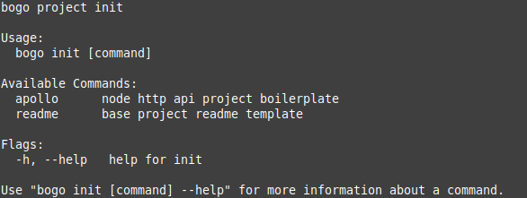

# Bogo

Bogo é uma ferramenta para inicialização de projetos por linha de comando

## Instalação e Atualização

A instalação ou atualização do bogo se dá por meio da execução do script de [install](./install.sh).

Para tanto você pode realizar o download e execução manual ou utilizar o cURL da seguinte maneira:

```bash
curl -so- https://raw.githubusercontent.com/realfabecker/bogo/master/install.sh | bash
```

O script acima irá realizar o download do ultimo release estável e extrairá esse na base do usuário.

## Configuração e Uso

A configuração base do bogo inicia-se pela definição da origem de repositórios:

```bash
bogo conf \
  --repo-url https://gist.github.com/realfabecker/258e9df1e521242b695bab8324922e44 \
  --repo-auth <github-developer-token>
```

A origem deve ser um github gist contendo um arquivo de nome **repositories.yaml** com o seguinte formato:

```yaml
projects:
  - name: readme
    url: https://gist.github.com/realfabecker/30e8dd4d2890f8d375d80a56b11d0b06
    description: base project readme template
    type: github-gist

  - name: apollo
    url: https://github.com/realfabecker/apollo.git
    description: node http api project boilerplate
    type: github-repo
```

A estrutura básica de configuração de um repositório consiste nos seguintes campos:

* name: nome do repositório utilizado como base de configuração.
* url: url de acesso para o recurso para download.
* description: descrição simplificada da base de configuração.
* type: tipo de repositório indicando comportamento de download a ser utilizado.

Um repositório pode ainda conter um **script** a ser executado após a sua instalação:

```yaml
projects:
  - name: apollo
    url: https://github.com/realfabecker/apollo.git
    description: node http api project boilerplate
    type: github-repo
    scripts:
      install: |
        npm install
```

É possível ainda para projetos do tipo github-gist dinamizar o conteúdo gerado por meio de variáveis:

```yaml
projects:
  - name: readme
    url: https://gist.github.com/realfabecker/30e8dd4d2890f8d375d80a56b11d0b06
    description: base project readme template
    type: github-gist
    vars:
      ProjectTitle:
        type: stdin
        description: Título do Projeto
      ProjectLink:
        type: stdin
        description: Link do Projeto
```

Cada chave da propriedade **vars** é interpretado como um placeholder a ser substituído no arquivo a ser gerado.

### Inicializando um projeto

Ao executar o bogo em sua interface **init**, estarão disponíveis os seguintes comandos de inicialização projeto:



Perceba que a interface segue a configuração base definida em [Configuração e Uso](#Configuração-e-Uso).

Os valores preenchidos nos campos **name** (readme e apollo) foram definidos como os comandos de inicialização.

| Cada nova entrada no arquivo será relacionado como um novo comando na interface de inicialização.

A inicialização de um projeto é definida de acordo com seu campo type, podendo esse ser das seguintes maneiras:

* github-gist: será realizado o download no diretório atual de todos os arquivos presentes na definição do gist.
* github-repo: será realizado o clone do repositório no diretório atual e removido desse o diretório .git.

## Contribuições

Refira-se ao guia de [contribuições](./docs/CONTRIBUTING.md) para detalhes de como contribuir para o projeto.

## Versionamento

O projeto utilizada [SemVer](https://semver.org/) para o versionamento. Para todas as versões disponíveis verifique as
[tags nesse repositório](https://github.com/realfabecker/bogo/tags).

## Licença

Este projeto considera a licença MIT. Verifique a [Licença](LICENSE.md) para mais informações.
